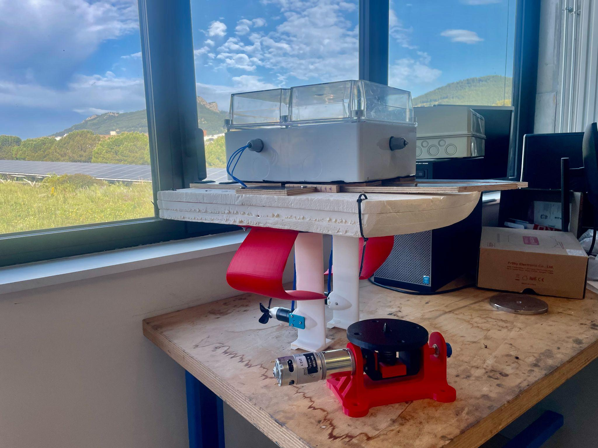
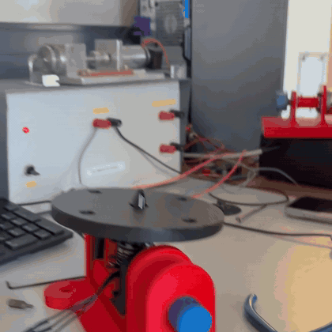
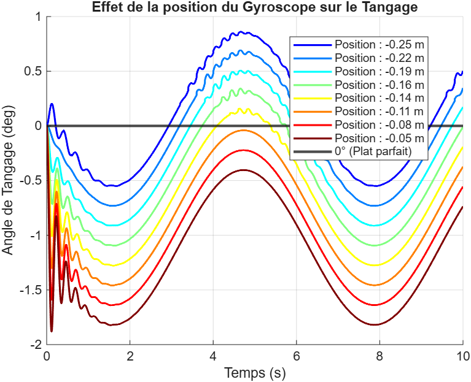
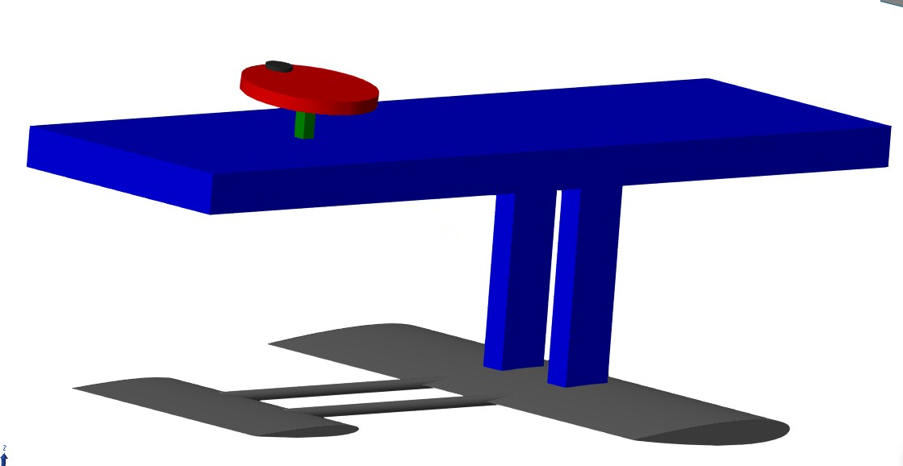
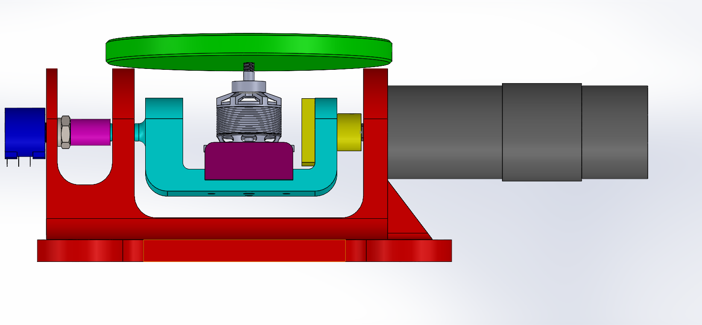
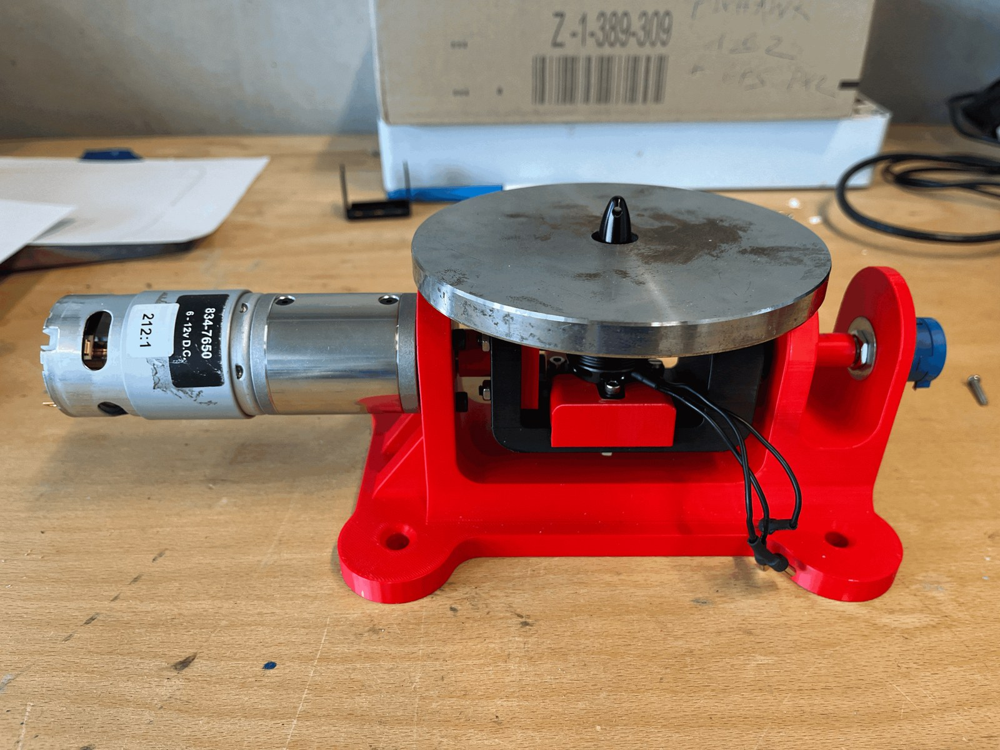
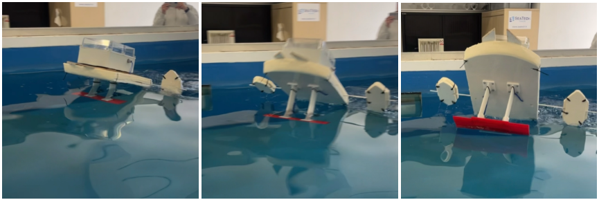

# 🌊 Gyro-Stabilized Hydrofoil Drone

A remote-controlled **hydrofoil drone** (a foiling boat) kept level by a
**gyroscopic stabilization system**. This SeaTech engineering project spans the whole
chain — functional analysis, **MATLAB/Simulink (Simscape) modelling**, CAD, 3D printing,
electronics and a **working prototype tested on the water**.



> The gyroscope in action: as the mount is tilted by hand, the spinning flywheel resists
> and holds its orientation — the same effect that keeps the foil platform level.



---

## Contents

- [Overview](#overview)
- [How it works](#how-it-works)
- [Simulation — the focus of this repo](#simulation--the-focus-of-this-repo)
- [Design & prototype](#design--prototype)
- [Repository structure](#repository-structure)
- [Running the simulation](#running-the-simulation)
- [Report](#-report)
- [Authors & contributions](#authors--contributions)

---

## Overview

Project of the **SYSMER** track (marine & robotic systems) at SeaTech — University of
Toulon, 2025–2026. A team of five designed and built a small remote-controlled hydrofoil
craft whose deck stays level thanks to a gyroscope.

The system combines **two complementary subsystems**:

1. **Gyroscopic stabilization** — *mechanical & passive*. A motor spins a flywheel; by
   conservation of angular momentum it resists roll and pitch and keeps the foil platform
   flat, without any active control loop.
2. **Embedded flight control** — *electronic & active*. Handles piloting, propulsion and
   the foiling height (how high the hull rides above the water).

---

## How it works

**Gyroscopic stabilization (passive).** The flywheel's angular momentum opposes any
tilt of the platform. The key design question is *where to place the centre of gravity*
so the stabilization is effective in both roll and pitch — this is exactly what the
Simulink model answers (see below).

**Embedded flight control (active).** The signal chain:

```
FlySky X7 radio → receiver → flight controller (Pixhawk / Navigator, running BlueOS)
→ Lua scripts ("motors", "height") read the height sensor and drive the motors
→ regulating the foiling height and the propulsion.
```

BlueOS is Blue Robotics' onboard operating system; the custom **Lua scripts** run on the
flight controller to close the height-regulation and propulsion loops.

---

## Simulation — the focus of this repo

The gyroscopic stabilization was modelled in **MATLAB / Simulink (Simscape Multibody)**.
The goal: find the **optimal longitudinal position of the centre of gravity** so that,
under a disturbance, the platform returns to level (0° = perfectly flat).

- `init_naca.m` — generates the **NACA 0012** foil (chord 0.15 m) and its winglet, and
  loads their coordinates into the workspace for the Simscape wing blocks.
- `Gyro_tanga.slx` + `Gyro_Tanga.m` — **pitch** study: sweeps 8 CoG positions
  (−0.25 m → −0.05 m) and plots the resulting pitch angle over time.
- `Gyro_roulis.slx` + `Gyro_Roulis.m` — **roll** study: sweeps CoG positions
  (−0.15 m → +0.15 m) and plots the roll angle.



*Effect of the CoG longitudinal position on pitch: the curve closest to 0° identifies
the best CoG placement for a stable, level platform.*

---

## Design & prototype

| | |
|---|---|
|  | **CAD** of the full foiling drone (deck + foils + gyroscope). |
|  | Cutaway of the **gyroscope mechanism** (motor + flywheel + gimbal). |
|  | The **3D-printed gyroscope** assembled (mount + motor + flywheel). |
|  | **On-water tests** of the prototype. |

The mechanical parts were **3D-printed**, assembled with the motors, flywheel, foils and
electronics, and tested on the water.

---

## Repository structure

```
.
├── init_naca.m             % NACA 0012 foil + winglet generation
├── Gyro_tanga.slx          % Simscape model — pitch
├── Gyro_Tanga.m            % CoG sweep (pitch) + plot
├── Gyro_roulis.slx         % Simscape model — roll
├── Gyro_Roulis.m           % CoG sweep (roll) + plot
├── Rapport.pdf             % Full project report (French)
├── presentation.pptx       % Project presentation (optional)
├── img/                    % Renders, prototype photos, results
└── README.md
```

---

## Running the simulation

**Requirements:** MATLAB with **Simulink** and **Simscape Multibody**.

```matlab
% From the repository folder, simply run a sweep script — it loads the NACA
% profiles and the Simulink model automatically:
Gyro_Tanga     % pitch study (sweeps the CoG, plots the pitch response)
Gyro_Roulis    % roll study
```

Each script opens its Simscape model, runs the simulation for 8 centre-of-gravity
positions, and overlays the angle responses so the best placement stands out.

---

## 📄 Report

Full project report — functional analysis, gyroscopic system, Simulink study, 3D design,
embedded system and prototype results (in French):

**➡️ [Rapport.pdf](Rapport.pdf)**

---

## Authors & contributions

Five-person project — SeaTech (University of Toulon), SYSMER, 2025–2026. Supervised by
Cédric Anthierens.

| Subsystem | Members |
|---|---|
| **Gyroscopic stabilization** (mechanical design, Simulink/Simscape modelling, CoG optimization, foil) | **Tom Hurard**, **Amélie Duchemin** |
| **Embedded flight control** (BlueOS, Lua scripting, RC piloting, height sensor, propulsion) | **Marie Bernard-Lameau**, **Anatole Collange**, **Antoine Hureau** |

*This repository centres on the gyroscopic-stabilization simulation. The embedded flight
control was developed by the other three team members and is described here for context.*
